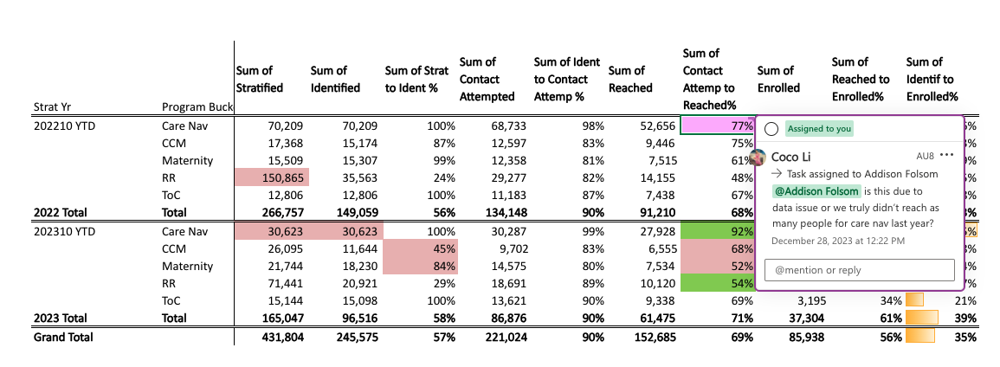

Why is care nav contact seem lower as a % in 2022 compared to 2023?
https://accolade365.sharepoint.com/:x:/r/sites/ClinicalIntelligenceAnalytics/_layouts/15/Doc.aspx?sourcedoc=%7BF7E8A2DA-1CC7-43D8-81D6-0B81D5B3EA37%7D&file=Accoalade%20Clinical%20Program%20Enrollment%20to%20Clinical%20Intervention%20Summary%202023-12-19.xlsx&nav=MTBfe0M5RDc2MjE0LTIxMjctREE0Ri1CNUQ1LTA0NUQ1N0Y4NTVCN31fezFCMDI5NzlBLTE3RDItRUY0MC05REE0LTBEQUQ5M0NGMkZGNn0&action=default&mobileredirect=true

